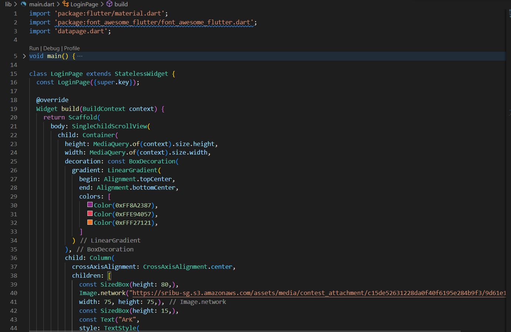
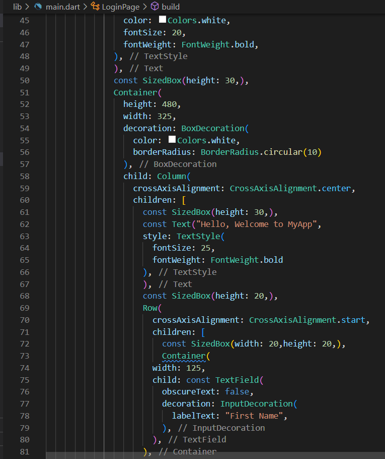
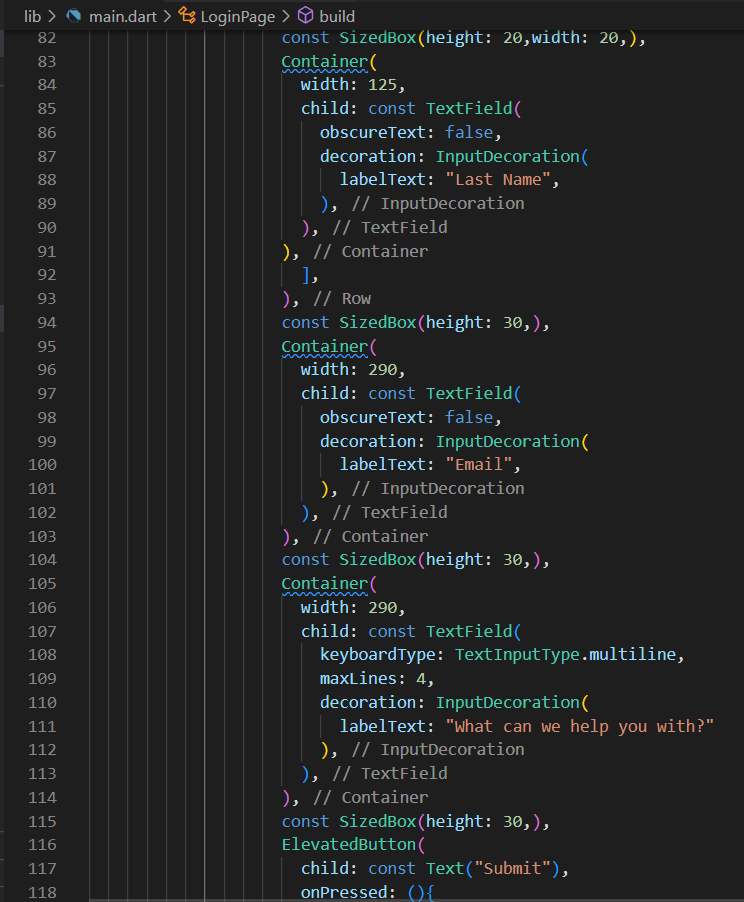
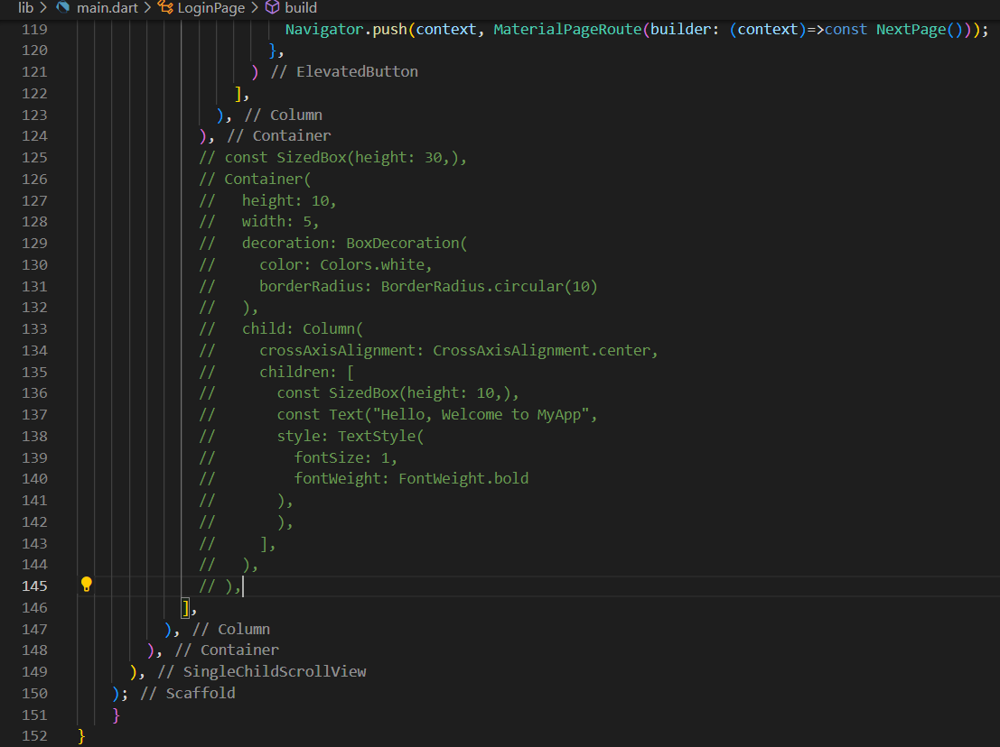
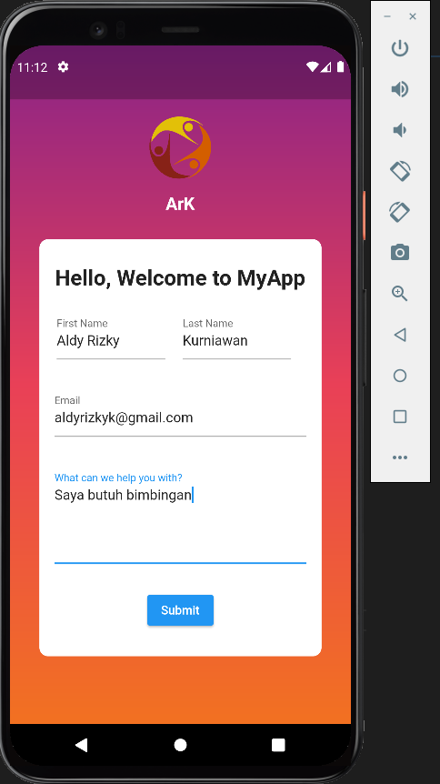
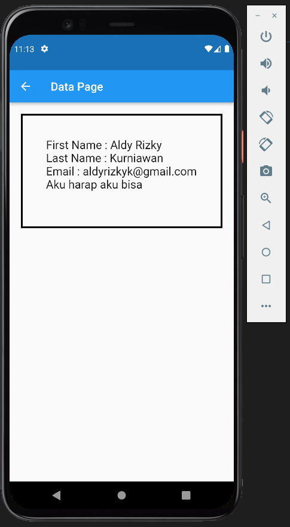

# Weekly Task 01
## Data Diri
Nomor Urut: 1_003FLB_36
Nama: Aldy Rizky Kurniawan

## Task
Berikut adalah kode program pada main dart. Saya membuat halaman menggunakan scaffold dengan body SingleChildScrollView yang memiliki child Container. Container memiliki child Column untuk diisi beberapa children Container. Untuk first name dan last name saya menggunakan Row. Kemudian yang terakhir saya menggunakan ElevatedButton untuk membuat tombol Submit.

Pada data page berisi data jika kita menekan tombol submit pada main.

Berikut adalah Hasilnya

